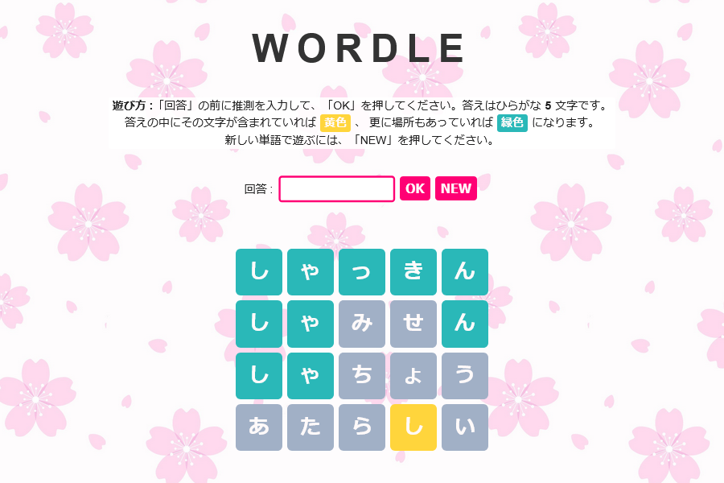

# Japanese Wordle
[Wordle](https://www.nytimes.com/games/wordle/index.html) is a simple and famous word game made by Josh Wardle.
Here is the Japanese Hiragana variation of it.
> Play here: [https://erfanazarmi.github.io/japanese-wordle/](https://erfanazarmi.github.io/japanese-wordle/) 

## How to play

The challenge is to guess a five letter word. Each time you guess, you're told which of your chosen letters are in the target word, and whether they are in the right place.

## Created with

- React
- Redux Toolkit
- TypeScript
